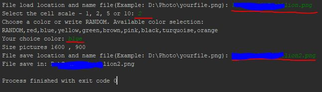
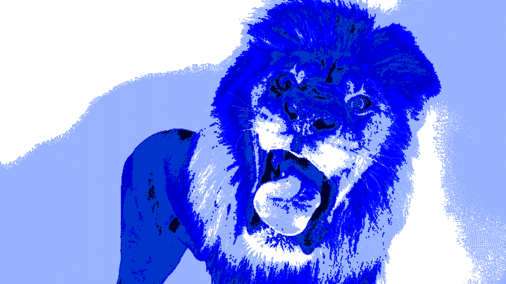
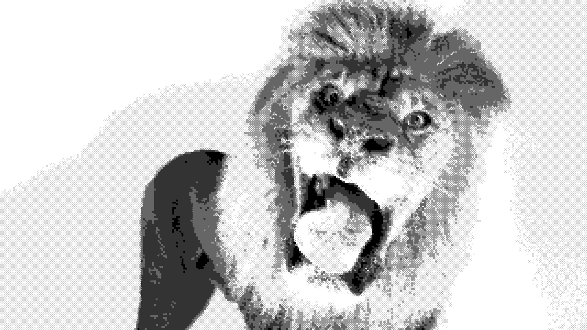

# Unusual_Copy_V01

A copy of the image using crosses of the specified length (in pixels) and the specified color.

# USAGE:



# ------------------------------------------------

#### Examples:

```php

    Original image:  
```


#### Results:
```php

    Color blue, length crosses - 2 pixels:  
```


```php

    Color black, length crosses - 5 pixels:  
```

